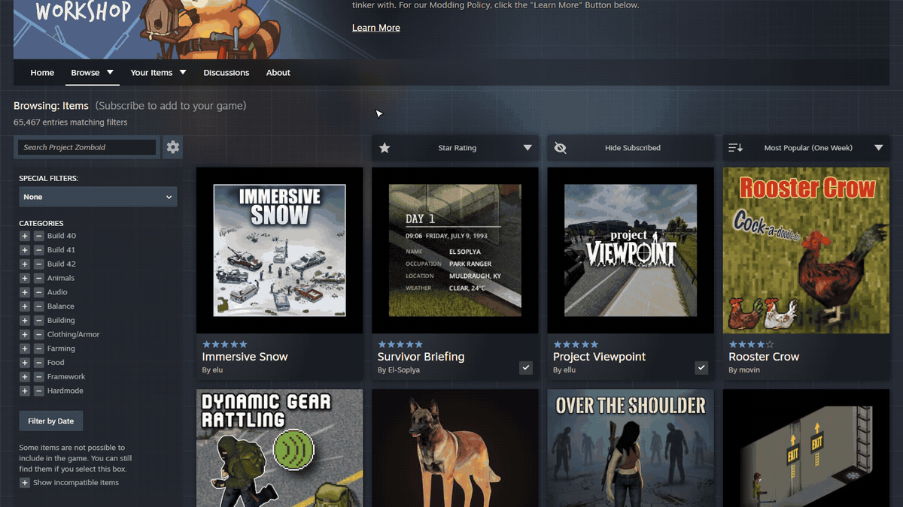
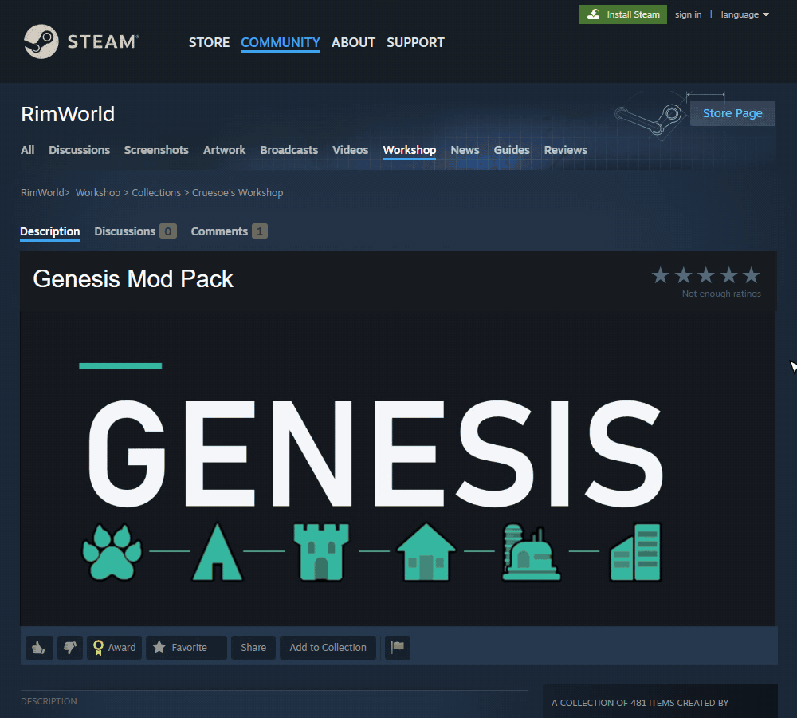

# Steam Workshop Filter Plus

A Chrome extension that adds filtering to Steam Workshop pages and collections: hide the mods you are already subscribed to and filter by star rating, so new high-quality content is easy to find.

## Preview


*On a Workshop page: hide subscribed mods, keep only 5-star mods, and sort with Steam's own menu - the filters stay on.*


*On a collection: hide what you already have, then keep only the 5-star mods.*

## Features

- **Hide Subscribed** button that hides every mod you are already subscribed to
- **Star Rating** filter (5 stars only, 4+, 3+, 2+, 1+)
- Remembers your choices between browser sessions
- Built into Steam's own UI:
  - On Workshop pages the buttons sit next to Steam's sort menu, match its style and line up with the mod card columns
  - On collection pages the buttons join the collection's own Subscribe / Unsubscribe / Save row
- Works on Steam's current Workshop layout and on the classic one
- Lightweight: no build step, no tracking, no data sent anywhere except Steam

## Installation

### From Chrome Web Store
- https://chromewebstore.google.com/detail/steam-workshop-filter-plu/ahdjppacldfaiahihkhfkhhmadhicfda

### Manual Installation (Developer Mode)
1. Download the latest zip from [Releases](https://github.com/dcave14/Steam-Workshop-Hide-Subscribed/releases) and unzip it, or clone this repository
2. Open Chrome and navigate to `chrome://extensions`
3. Enable "Developer mode" in the top right
4. Click "Load unpacked"
5. Select the folder containing `manifest.json`

## Usage

1. Open any Steam Workshop page (for example `steamcommunity.com/app/<appid>/workshop/` or
   `steamcommunity.com/workshop/browse/?appid=<appid>`) or a collection page
   (`steamcommunity.com/sharedfiles/filedetails/?id=<collectionid>`)
2. Use the controls next to the sort menu (Workshop pages) or under the Subscribe to all row (collections):
   - **Hide Subscribed** toggles visibility of subscribed items (sign in to Steam for this one)
   - **Star Rating** filters by minimum star rating
3. Your choices are saved automatically

## How It Works

The extension:
1. Adds the filter controls to Workshop and collection pages
2. Reads each item's star rating and subscribed state
3. Hides items that don't pass the filters
4. Watches for new content (paging, sorting, infinite scroll) and filters it too
5. Saves your choices with Chrome's storage API

Steam's current Workshop layout is rendered by React with generated class names, so the
extension finds things by page structure instead. Subscribed state is not part of that
page, so while Hide Subscribed is on and you are signed in, the extension asks Steam
(`/sharedfiles/actions?q=GetUserListStatus`, with your existing Steam login) which of the
items on the page you are subscribed to. Star ratings come from the card's star icons, with
the page's embedded data as a fallback. The buttons are only added once React has finished
setting up the page, so Steam's own page keeps working normally.

See the [privacy policy](https://dcave14.github.io/Steam-Workshop-Hide-Subscribed/privacy-policy.html) for exactly what is stored and sent.

## Development

### Project Structure
```
├── manifest.json            Extension manifest
├── steam-dom.js             Finds cards, ratings and subscribed state on Steam's current layout
├── content.js               Injects the controls, applies the filters, sizes the buttons
├── collection-row-align.js  Lines the controls up with the collection page's button row
├── sort-popover-fit.js      Fits Steam's sort menu to the width of the sort button
├── hydration-signal.js      Tells content.js when Steam's page has finished loading (React)
├── styles.css               Styles for the controls and dropdowns
├── docs/                    Privacy policy page (GitHub Pages) and README GIFs
├── perf/                    Performance test (Puppeteer)
└── promo/                   Scripts for the promo video, store images and README GIFs
```

### Building
No build step - plain JavaScript. To make a store package, zip the files referenced by
`manifest.json` (the manifest, the five scripts, `styles.css` and the icon).

### Testing
1. Make changes to the code
2. Reload the extension in `chrome://extensions`
3. Test on Steam Workshop pages and a collection page

Performance test (headless Chrome, compares pages with and without the extension):
```
cd perf
npm install
npm run perf
```
See `TESTING.md` for the full runtime checklist.

## Contributing

Contributions are welcome! Please feel free to submit a Pull Request.

1. Fork the repository
2. Create your feature branch (`git checkout -b feature/AmazingFeature`)
3. Commit your changes (`git commit -m 'Add some AmazingFeature'`)
4. Push to the branch (`git push origin feature/AmazingFeature`)
5. Open a Pull Request

## License

Distributed under the MIT License. See `LICENSE` for more information.

## Contact

dcave14 - [GitHub Profile](https://github.com/dcave14)

## Changelog

### 1.3.0
- Support for Steam's new Workshop layout (`steamcommunity.com/app/*/workshop/*` and the
  new browse pages): card detection, star ratings and subscribed state via Steam's
  `GetUserListStatus` query
- Filters on collection pages, joined to the collection's Subscribe / Unsubscribe / Save row
- Controls rebuilt in Steam's own style, placed next to the sort menu and sized to the mod
  card width so all three buttons sit flush on the card columns at any window size (the
  labels shrink slightly on narrow windows instead of the buttons overhanging)
- Steam's sort menu is fitted to the width of the sort button
- Star Rating dropdown restyled to match each page
- Buttons appear as soon as Steam's page is ready (about 1.4s instead of 3s+)
- Faster on large collections: no extra page-load delay, fewer layout passes, quicker clicks
- Added a performance test (`perf/`)
- Updated the privacy policy (now hosted on GitHub Pages)

### 1.2.0
- Added support for multiple item types (collection, workshop item, etc.)
- Improved filter logic to handle different item structures

### 1.1.0
- Added star rating filter
- UI improvements with dropdown menu
- Enhanced filter persistence
- Fixed issues with dynamic content loading

### 1.0.0
- Initial release
- Basic hide/show functionality
- Persistent storage of preferences
- Infinite scroll support
